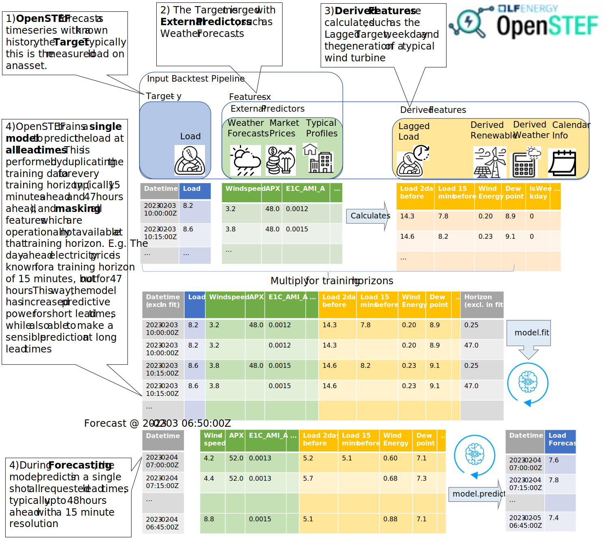
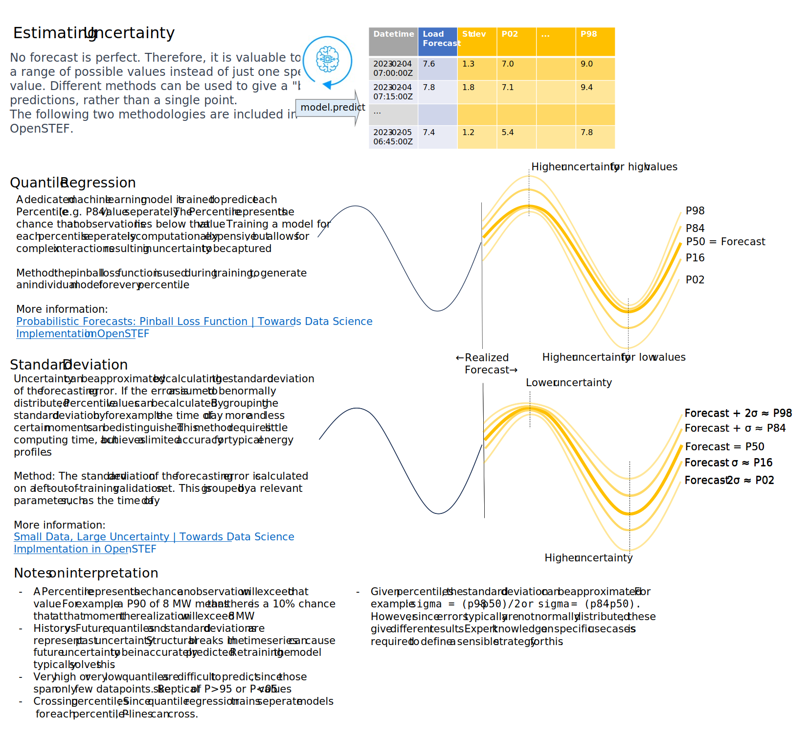

# Методологія високого рівня OpenSTEF

OpenSTEF автоматизує багато типових дій у машинному навчанні. До них
відносяться комбінування вхідних даних і підготовка ознак. Крім того,
методологія навчання та прогнозування OpenSTEF дозволяє робити
одномоментний, багатогоризонтний прогноз. Щоб забезпечити високорівневий
огляд цих функціональних можливостей, тут наведено схематичне
зображення.

[Source file](_static/methodology_train_predict.pptx)

OpenSTEF надає довірчі оцінки своїх прогнозів. Доступні два методи. На
малюнку нижче пояснюються відмінності та подібності між цими двома
методами, а також надає рекомендації щодо того, як слід використовувати
довірчі оцінки.

[Source file](_static/methodology_train_predict.pptx)
