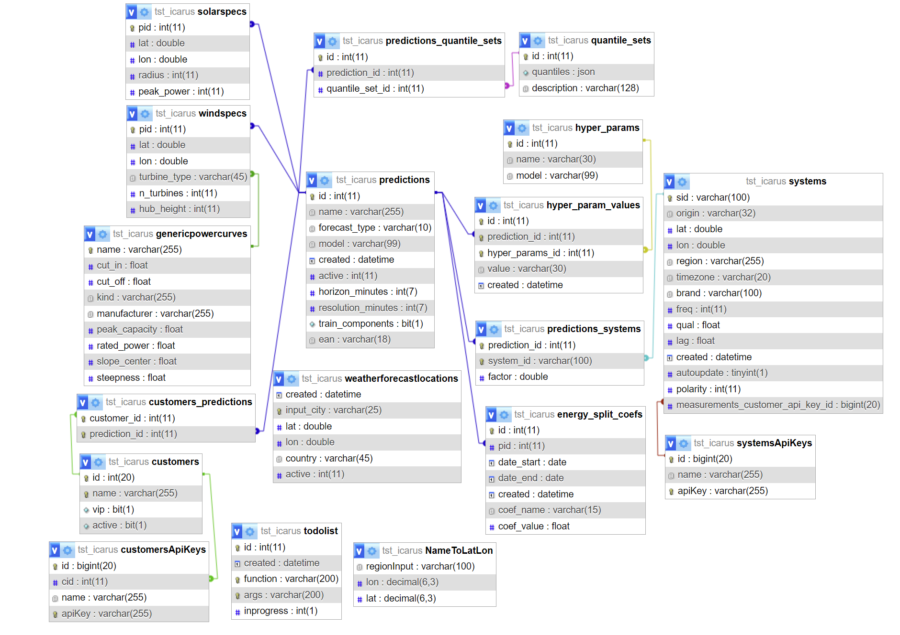

# Огляд реляційної бази даних

OpenSTEF використовує реляційну базу даних для зберігання інформації про
завдання прогнозування та вимірювання. ER-діаграма цієї бази даних
показана нижче.

Більш детально необхідні таблиці описані нижче:

## клієнти

<table style="width:97%;">
<colgroup>
<col style="width: 23%" />
<col style="width: 15%" />
<col style="width: 33%" />
<col style="width: 25%" />
</colgroup>
<thead>
<tr class="header">
<th><strong>Ім'я</strong></th>
<th><strong>Тип</strong></th>
<th><strong>Коментарій</strong></th>
<th><strong>Приклад</strong></th>
</tr>
</thead>
<tbody>
<tr class="odd">
<td>id</td>
<td>int</td>
<td>id клієнта</td>
<td>307</td>
</tr>
<tr class="even">
<td>name</td>
<td>chr</td>
<td>Ім'я клієнта</td>
<td>Location_A</td>
</tr>
<tr class="odd">
<td>vip</td>
<td>bool</td>
<td><dl>
<dt>дуже важливий прогноз</dt>
<dd>

(не підтримується)

</dd>
</dl></td>
<td>1</td>
</tr>
<tr class="even">
<td>active</td>
<td>bool</td>
<td>статус активності</td>
<td>1</td>
</tr>
</tbody>
</table>

**Customer** : Клієнт - це колекція прогнозів. Це може бути колекція
прогнозів, що належить клієнту, а також колекція прогнозів, що належить
певній місцевості або підстанції.

## Клієнтські API Ключі

| **Ім'я** | **Тип** | **Коментарій**     | **Приклад**     |
|----------|---------|--------------------|-----------------|
| id       | int     | id ключа API       | 94              |
| cid      | int     | id клієнта         | 307             |
| name     | chr     | Ім'я клієнта       | Location_A      |
| apiKey   | chr     | значення ключа API | uuid-Location_A |

Користувачі можуть публікувати вимірювання або отримувати прогнози,
пов'язані з конкретного клієнта (використовується всередині Alliander).

**customers_predictions**

Таблиця відповідності між ідентифікаторами клієнтів та ідентифікаторами
завдань прогнозування.

| **Ім'я**      | **Тип** | **Коментарій**         | **Приклад** |
|---------------|---------|------------------------|-------------|
| customer_id   | int     | id клієнта             | 307         |
| prediction_id | int     | id роботи передбачення | 313         |

## загальні криві потужності

Містить загальні криві навантаження вітрових турбін. Ці криві мають
вигляд двопараметричні сигмоїди (центр і нахил).

| **Ім'я**      | **Тип** | **Коментарій**                                                      | **Приклад** |
|---------------|---------|---------------------------------------------------------------------|-------------|
| name          | chr     | Ім'я турбіни                                                        | Vestas V112 |
| cut_in        | float   | мінімальна швидкість вітру для виробітку (м/с)                      | 3           |
| cut_off       | float   | максимальна швидкість вітру для виробітку (м/с)                     | 25          |
| kind          | chr     | на берег / с берегу                                                 | onshore     |
| manufacturer  | chr     |                                                                     | Enercon     |
| peak_capacity | float   | максимальна потужність (Вт)                                         | 3040270     |
| rated_power   | float   | номінальна потужність (Вт)                                          | 3000000     |
| slope_center  | float   | швидкість вітру, яка відповідає 50% від номінальної потужності(м/с) | 7.91        |
| steepness     | float   | Див. формулу                                                        | 0.76        |

В openstef/feature_engineering/weather_features.py потужність, що
виробляється вітрової турбіни обчислюється як

P(v) = *P**r**a**t**e**d*/{1 + e^{- k(v - c)}},

де *v* швидкість вітру на висоті хаба, *P**r**a**t**e**d* =
rated_power, *k* = steepness і *c* = slope_center.

## NameToLatLon

| **Ім'я**    | **Тип** | **Коментарій** | **Приклад** |
|-------------|---------|----------------|-------------|
| regionInput | chr     | назва регіону  | Leeuwarden  |
| lon         | decimal | довгота        | 5.800       |
| lat         | decimal | широта         | 53.201      |

Ця таблиця використовується для пошуку координат певних місць, які
можуть бути використані безпосередньо для отримання погодних даних.

## predictions

Містить роботи передбачення.

| **Ім'я**           | **Тип**  | **Коментарій**                                                                                                                         | **Приклад**         |
|--------------------|----------|----------------------------------------------------------------------------------------------------------------------------------------|---------------------|
| id                 | int      | ідентифікатор роботи передбачення                                                                                                      | 313                 |
| name               | chr      | ім'я клієнта                                                                                                                           | Location_A          |
| forecast_type      | chr      | тип прогнозу                                                                                                                           | demand              |
| model              | chr      | тип моделі                                                                                                                             | xgb                 |
| created            | datetime | дата створення роботи передбачення                                                                                                     | 2019-05-16 14:53:38 |
| active             | int      | 0 = off; 1 = on;                                                                                                                       |                     |
| horizon_minutes    | int      | максимальний горизонт прогнозування (хвилини)                                                                                          | 2880                |
| resolution_minutes | int      | часова роздільність прогнозів (хвилини)                                                                                                | 15                  |
| train_components   | bool     | Необов’язково: виконайте розподіл енергії для цієї роботи прогнозування                                                                | 1                   |
| ean                | chr      | EAN точки з'єднання, якщо прогноз відповідає точці з'єднання. Див. також: <https://en.wikipedia.org/wiki/International_Article_Number> | 000000000000000003  |

**Prediction**: Передбачення є основним поняттям в openSTEF і в
основному перекладається як prediction_job в коді openSTEF. Щоб зробити
прогноз, прогноз зазвичай пов'язаний з однією або декількома системами.
Ці системи надають дані вимірювань, для яких робиться прогноз.

## predictions_quantiles_sets

Таблиця відповідності між завданнями передбачення та набором квантилів
для для прогнозування.

| **Ім'я**        | **Тип** | **Коментарій**         | **Приклад** |
|-----------------|---------|------------------------|-------------|
| id              | int     |                        | 22          |
| prediction_id   | int     | id роботи передбачення | 313         |
| quantile_set_id | int     | id набору квантилів    | 1           |

## predictions_systems

Таблиця відповідності між роботами передбачення та системами.

| **Ім'я**      | **Тип** | **Коментарій**                                   | **Приклад**          |
|---------------|---------|--------------------------------------------------|----------------------|
| prediction_id | int     | id роботи передбачення                           | 317                  |
| system_id     | chr     | id системи                                       | Location_A\_System_1 |
| factor        | double  | Додатковий множник для множення перед додаванням | -2.0                 |

-   Одна **prediction job** може відповідати декільком **systems**.
-   Одна **system** може бути пов'язана з декількома **prediction
    jobs**.
-   Коли кілька систем пов'язані з прогнозом, всі ці системи додаються,
    і прогноз робиться для суми. Якщо з якихось причин система не
    повинна додаватися, а відніматися, можна встановити коефіцієнт на
    -1. Якщо необхідно провести деяке масштабування суми, коефіцієнт
    може бути змінений з 1 (за замовчуванням) на бажаний коефіцієнт
    масштабування.

**System** : Відображає фізичну систему вимірювання. Всі метадані
зберігаються в цій таблиці SQL, фактичні часові ряди можна отримати з
вхідних даних за відповідним ідентифікатором системи.

## quantiles_sets

Містить специфікації наборів квантилів.

| **Ім'я**    | **Тип** | **Коментарій**      | **Приклад**                             |
|-------------|---------|---------------------|-----------------------------------------|
| id          | int     | id набору квантилів |                                         |
| quantiles   | json    | список квантилів    | \[0.05, 0.1, 0.3, 0.5, 0.7, 0.9, 0.95\] |
| description | chr     |                     | Default quantile set                    |

## solarspecs

Конфігурація для прогнозування PV для кожної роботи передбачення

| **Ім'я**   | **Тип** | **Коментарій**         | **Приклад** |
|------------|---------|------------------------|-------------|
| pid        | int     | id роботи передбачення | 123         |
| lat        | double  | широта                 | 51.9850343  |
| lon        | double  | довгота                | 5.8956792   |
| radius     | int     | радіус в км            | 10          |
| peak_power | int     | максимальна потужність | 1000        |

2 випадки:

-   Radius = 'None' : коли прогноз робиться для конкретної системи
-   Radius \> 0, коли прогноз для регіону

## systems

Містить інформацію про **systems**.

| **Ім'я**                         | **Тип**  | **Коментарій**                                 | **Приклад**                            |
|----------------------------------|----------|------------------------------------------------|----------------------------------------|
| sid                              | chr      | id системи                                     | Location_A\_System_1                   |
| origin                           | chr      | походження системних даних                     | ems (energy management system = SCADA) |
| lat                              | double   | широта                                         | 5.837                                  |
| lon                              | double   | довгота                                        | 51.813                                 |
| region                           | chr      |                                                | Gelderland                             |
| timezone                         | chr      |                                                | UTC                                    |
| brand                            | chr      | додаткова інформація про виміри                | accurate_inc                           |
| freq                             | int      | додаткова інформація про виміри                | 5                                      |
| qual                             | float    | додаткова інформація про виміри                | 1                                      |
| lag                              | float    | додаткова інформація про виміри                | 15                                     |
| created                          | datetime | Дата реєстрації системи в openSTEF             | 2021-01-25 09:44:00                    |
| autoupdate                       | tinyint  | застарілий                                     | 1                                      |
| polarity                         | int      | знак конвенції для виробництва та навантаження | -1/1                                   |
| measurements_customer_api_key_id | int      | API для публікації вимірювань                  | 199                                    |

**Polarity** коефіцієнт, який використовується для того, щоб вимірювання
відповідало позитивному споживанню та негативному виробництву енергії.

## systemsApiKeys

Ключ API для отримання системних вимірювань.

| **Ім'я** | **Тип** | **Коментарій**     | **Приклад**       |
|----------|---------|--------------------|-------------------|
| id       | int     | id ключа API       | 199               |
| name     | chr     |                    | Measurements      |
| apiKey   | chr     | значення ключа API | uuid-Measurements |

## weatherforecastlocations

Містить розташування метеостанцій. Вони використовуються при отриманні
погодних даних для передбачення.

| **Ім'я**   | **Тип**  | **Коментарій** | **Приклад**         |
|------------|----------|----------------|---------------------|
| created    | datetime |                | 2023-06-08 18:26:44 |
| input_city | chr      |                | Deelen              |
| lat        | double   |                | 52.067              |
| lon        | double   |                | 5.8                 |
| country    | chr      |                | NL                  |
| active     | int      |                | 1                   |

## windspecs

У openstef-reference ця таблиця порожня. Містить інформацію для прогнозу
вітрової енергії, пов'язаного з роботою передбачення.

| **Ім'я**     | **Тип** | **Коментарій**                                       | **Приклад** |
|--------------|---------|------------------------------------------------------|-------------|
| pid          | int     | id роботи передбачення                               |             |
| lat          | double  |                                                      |             |
| lon          | double  |                                                      |             |
| turbine_type | chr     | відповідає полю «ім’я» у загальних кривих потужності |             |
| n_turbines   | int     | кількість вітрових турбін                            |             |
| hub_height   | int     | висота турбіни (м)                                   |             |

Висота хаба використовується для екстраполяції прогнозу швидкості вітру
на правильній висоті.
